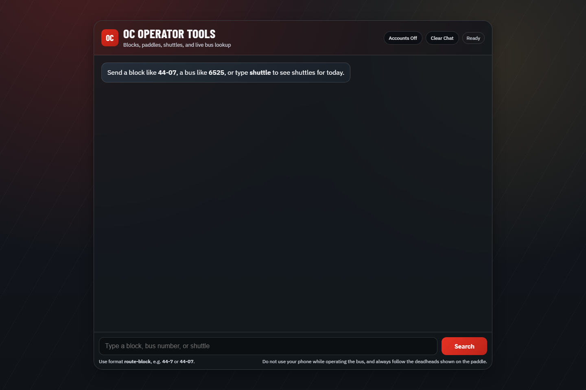
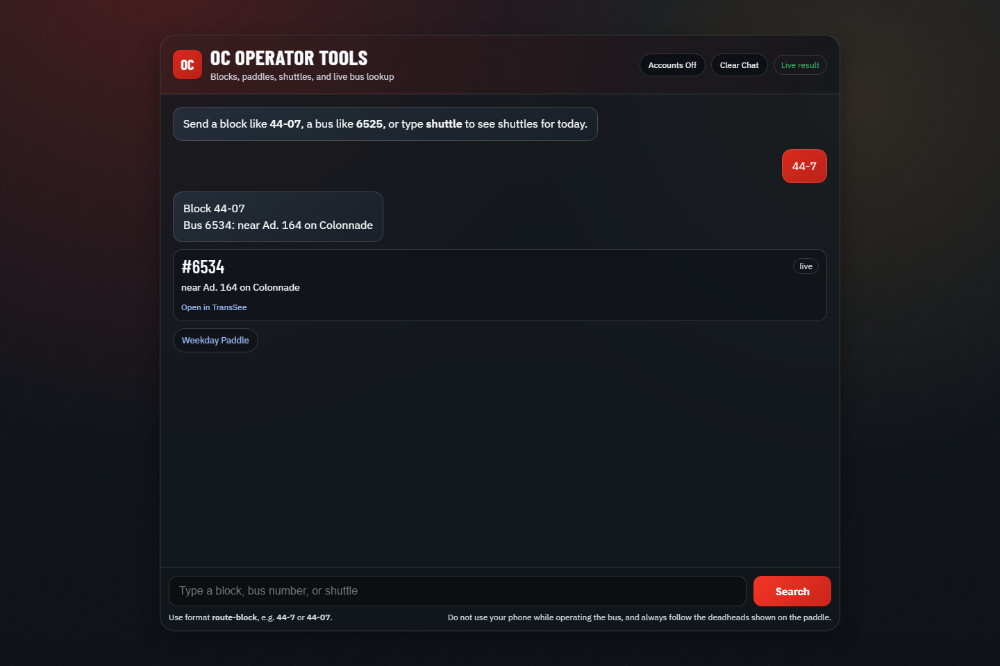
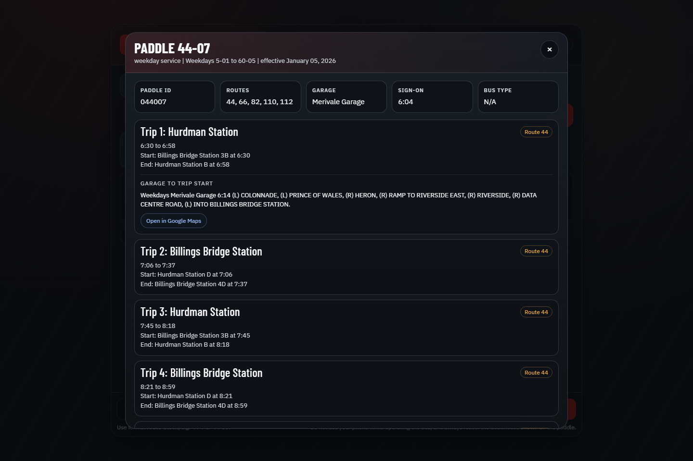
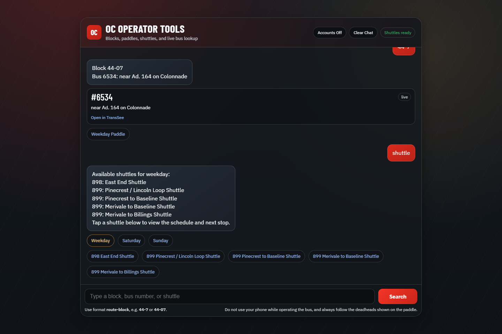
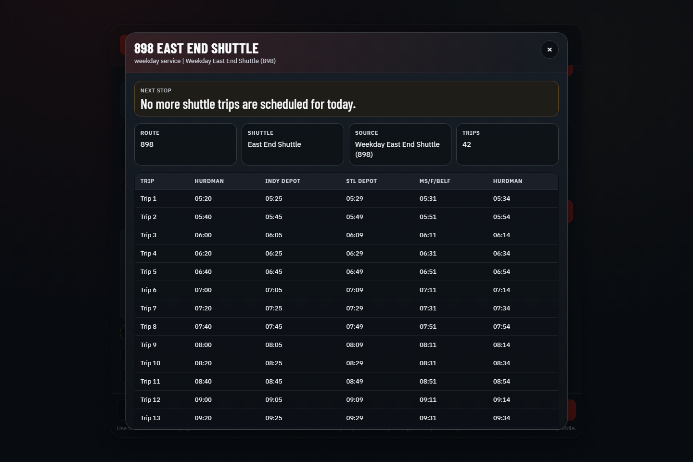

# OC Operator Tools

OC Operator Tools is a web app built by an operator, for operators. It brings together block lookups, paddle viewing, shuttle schedules, and live bus location checks in one place so operators can quickly find the information they need during sign-in, reliefs, planning, and day-to-day work.

Live app: [https://oc-bus-tracker.vercel.app/](https://oc-bus-tracker.vercel.app/)

## What it does

- Look up a block and get live bus location information when available
- Show all available paddle versions for a block by service day
- Open full paddles with trips, notes, relief points, and deadhead directions
- Open Google Maps directions for deadhead segments
- Look up a bus number directly and show its current location
- Show shuttle schedules for weekday, Saturday, and Sunday service
- Highlight the active trip/next stop when a shuttle or paddle is live for the current day
- Save work blocks and shuttles with an account for quick lookup
- Support password reset and basic account settings through Supabase
- Provide hidden operator tools like `showall` for scheduled active paddles

## Main workflows

### 1. Home screen

Use the search box to enter:

- a block like `44-07`
- a bus like `6525`
- `shuttle` to view shuttle schedules

### 2. Block lookup

Enter a block number to get the currently assigned live bus when available. If paddle data exists, the app also shows paddle buttons below the reply.

### 3. Paddle viewer

Use the paddle button to open the full paddle for the selected service day. The paddle viewer includes:

- all trips on the paddle
- start, relief, and end details
- notes attached to trips
- deadhead directions
- Google Maps links for deadheads

### 4. Shuttle lookup

Type `shuttle` to get the shuttles available for the current day. You can also switch between weekday, Saturday, and Sunday schedules from the shuttle buttons.

### 5. Shuttle schedule

Open any shuttle to view its full schedule. When that shuttle is live for the current day, the app shows the next stop summary and highlights the relevant trip.

## Commands and input examples

### Standard input

- `44-07`
- `44-7`
- `6525`
- `shuttle`
- `shuttle weekday`
- `shuttle saturday`
- `shuttle sunday`

### Hidden operator commands

- `showall`
  Shows paddles that are scheduled active right now based on paddle timing

## Accounts and quick lookup

When Supabase is configured, operators can:

- create an account
- sign in and out
- reset a forgotten password
- save weekday, Saturday, and Sunday work blocks
- save shuttle shortcuts
- use quick lookup buttons after signing in

## Tech stack

- Node.js
- Express
- Playwright
- Supabase Auth + Postgres
- Vercel

## Notes

- Live bus data depends on upstream availability and may occasionally be missing even when a paddle is scheduled active.
- Paddle and shuttle data are intended as operator reference tools.
- Operators should always follow official paddle and deadhead instructions.
- Do not use your phone while operating a bus.
